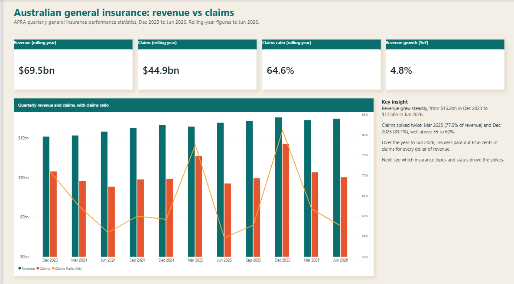
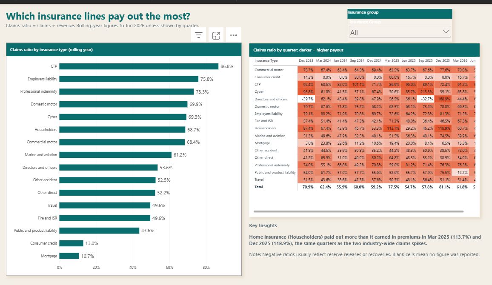
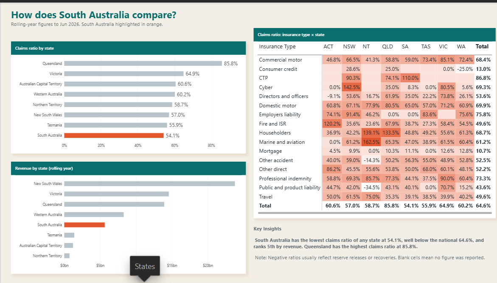

# Australian General Insurance: Revenue vs Claims (Power BI)

A Power BI report analysing Australian general insurance performance using APRA's quarterly statistics, **Dec 2023 to Jun 2026**. It answers three questions:

1. How much are insurers paying out in claims compared with what they earn?
2. Which insurance lines pay out the most?
3. How does South Australia compare with other states?

---

## Key findings

- **Insurers paid out 64.6 cents in claims for every dollar of revenue** in the year to Jun 2026 ($44.9bn claims on $69.5bn revenue). Revenue grew 4.8% year on year.
- **Quarterly revenue grew steadily**, from $15.2bn in Dec 2023 to $17.5bn in Jun 2026.
- **Claims spiked twice**: Mar 2025 (77.5% of revenue) and Dec 2025 (81.1%). Most other quarters were 55–62%.
- **Home insurance (Householders) paid out more than it earned** in those same two quarters: 113.7% in Mar 2025 and 118.9% in Dec 2025.
- **CTP has the highest claims ratio** of any line (86.8%). Mortgage insurance has the lowest (10.7%).
- **South Australia has the lowest claims ratio of any state** (54.1%, against 64.6% nationally) and ranks 5th by revenue. Queensland has the highest (85.8%).

---

## Report pages

| Page | Question | Visuals |
|------|----------|---------|
| Industry Overview | Revenue vs claims over time | KPI cards, quarterly revenue and claims with claims ratio line |
| Insurance Type | Which lines pay out the most? | Ranked bar chart, quarterly heatmap matrix, insurance group slicer |
| States | How does SA compare? | Claims ratio and revenue by state (SA highlighted), insurance type × state heatmap |

---

## Data

- **Source:** Australian Prudential Regulation Authority (APRA), *Quarterly General Insurance Performance Statistics*: https://www.apra.gov.au
- **Period:** Dec 2023 to Jun 2026 (11 quarters)
- **Measures used:** Revenue and claims, by insurance type and by state

**Notes on the data**
- *Claims ratio = claims ÷ revenue.*
- *Rolling year* figures are the sum of the latest four quarters (to Jun 2026).
- Negative claims ratios usually reflect reserve releases or recoveries.
- Blank cells mean APRA did not report a figure for that state and insurance type.

---

## Data model

- **Insurance Data** (fact table): insurance group, insurance type, state, measure, quarter end, value
- **Date** (date table): quarter, quarter label, financial year, year
- **Measure_Table**: all DAX measures kept in one place

**Main DAX measures**
- `Revenue`, `Claims`: base totals
- `Revenue R4Q`, `Claims R4Q`: rolling four-quarter totals
- `Claims Ratio R4Q`: rolling-year claims ÷ revenue
- `Claims Ratio (Qtr)`: quarterly claims ratio
- `Revenue YoY %`: year-on-year revenue growth
- `Revenue less Claims`

A hidden **Data Check** page was used to reconcile totals against the APRA source files.

---

## Tools and skills

Power BI Desktop · Power Query · DAX (time intelligence, rolling totals) · data modelling · conditional formatting · data storytelling

---

## How to open

1. Download `Australian-General-Insurance.pbix`.
2. Open it in Power BI Desktop (free).

---

## About me

**Shivani Sharma**, Adelaide, SA
Microsoft Certified: Power BI Data Analyst Associate (PL-300)
[LinkedIn]www.linkedin.com/in/shivanisharma40285

